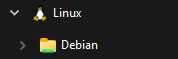
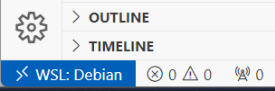
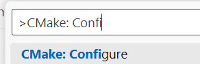
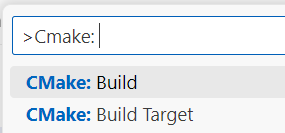
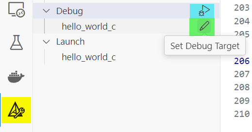

# README

 
 


This repository contains material and source code examples corresponding to the "Algorithm & Datastructures" lecture at FOM Hochschule für Oekonomie & Management gGmbH.

The source code can be compiled "traditionally" utilizing CMake or conveniently compiled and executed in a Docker container.

Any reasonably recent Debian version or Debian-based system like Ubuntu or Linux Mint will be suitable for this guide, either running directly on the computer or within the "Windows Subsystem for Linux".

**Table of Contents**

<!-- 
Updating toc:
cd ~ && npm install doctoc
~/node_modules/doctoc/doctoc.js --github README.md
 -->

<!-- \cond DO_NOT_DOCUMENT
-->
<!-- START doctoc generated TOC please keep comment here to allow auto update -->
<!-- DON'T EDIT THIS SECTION, INSTEAD RE-RUN doctoc TO UPDATE -->


- [Quick Start: Local Build on Commandline](#quick-start-local-build-on-commandline)
  - [Clone Repository](#clone-repository)
  - [Local Build Requirements](#local-build-requirements)
  - [Local Build Execution](#local-build-execution)
  - [Add own source code (from scratch)](#add-own-source-code-from-scratch)
  - [Work on exercises (from "snippets")](#work-on-exercises-from-snippets)
- [Integrated Development Environment](#integrated-development-environment)
  - [Running CMake in Visual Studio Code](#running-cmake-in-visual-studio-code)
  - [Running Programs in VS Code](#running-programs-in-vs-code)
- [Interacting with the repository](#interacting-with-the-repository)
  - [Cleaning the build folder](#cleaning-the-build-folder)
  - [Getting updates](#getting-updates)
  - [Reverting local changes](#reverting-local-changes)
- [Optional parts](#optional-parts)
  - [Recommended addons](#recommended-addons)
    - [Boost](#boost)
    - [GoogleTest](#googletest)
    - [Doxygen](#doxygen)
    - [Valgrind](#valgrind)
    - [cppcheck](#cppcheck)
  - [Docker-based Build Environment](#docker-based-build-environment)
    - [Installing Docker](#installing-docker)
    - [Building and Executing](#building-and-executing)
  - [Windows-native builds](#windows-native-builds)
  - [Playgrounds](#playgrounds)
    - [Assembler & Qemu](#assembler--qemu)
    - [Rust](#rust)
    - [Terraform](#terraform)
    - [Alternative Compilers](#alternative-compilers)
- [References](#references)
  - [Examples and some additional literature:](#examples-and-some-additional-literature)
  - [Toolchain](#toolchain)

<!-- END doctoc generated TOC please keep comment here to allow auto update -->
<!-- \endcond
-->

## Quick Start: Local Build on Commandline

The following steps describe the minimal environment to download, compile and run the examples from this repository - and how to create own build targets.
No IDE is required yet, it all works on the commandline.

### Clone Repository

This section describes, how to "clone" all the files in this reporitoy to have them available locally.

- First, we need git for it - so let's install it:
```sh
# sudo or do as user `root`
apt-get install git
```
- Then as "normal" user (not root!) clone this repository locally. _Note:_ This is cloning via https Web URL. Alternatively, ssh could be used.
```sh
# cd to your local workspace folder of choice
git clone https://github.com/thorstendikmann/fomss2024aud.git
```

### Local Build Requirements

This section describes how to compile and run the source code directly on the computer.

- Most notably, a C/C++ compiler suite needs to be installed. Luckily, Debian covers most of if in the package `build-essential`. We additionally need `cmake` and the `gdb` Debugger.
```sh
# sudo or do as user `root`
apt-get install cmake build-essential gdb
```

### Local Build Execution

This describes how to compile the source code files in this repository and execute examples.

- We're running an out-of-source build in the `build` folder (= the created binaries and auxiliary files will be in a separate directory).
```sh
mkdir -p build && cd build
cmake ..
```

- Let's run an example
```sh
make
bin/hello/hello_world_c
```

### Add own source code (from scratch)

- It's recommended to utilize the [src/user](src/user) folder for own developments. To avoid potential conflicts with the repository, let's create a separate folder for you. Assuming `xy` are your initials:
```sh
# cd .. # if you`re still within the build dir!
mkdir -p src/user/xy
cd src/user/xy
```
- Let's create a new source code file - and a cmake file called `CMakeLists.txt`.
```sh
touch helloxy.c
touch CMakeLists.txt
```
- Open these files in your editor of choice and add the following content:
```C
// helloxy.c
#include<stdio.h>

int main(void) {
	printf("Hello World from XY\n");
	return 0;
}
```
```cmake
# CMakeLists.txt
add_executable(helloxy helloxy.c)
```
- Now we can compile and execute this. Let's go to the `build` folder first:
```sh
cd ../../../build
cmake
make

bin/user/helloxy
```

### Work on exercises (from "snippets")

- Best is to copy the relevant folder from [src/snippets](src/snippets) to your [src/user/xy](src/user) folder just created above, e.g. for `factorial` example in []
```
cp -r  src/snippets/01_einfuehrung/factorial src/user/xy/
```
- Now modify the `CMakeLists.txt` in the copied folder to adjust the name of your build target:
```CMake
add_executable(factorial_xy factorial.c)  ## replace the _snp by _xy (or whatever)
```

## Integrated Development Environment

A graphical IDE is optional, but generally considered to be very useful supporting the productivity in the development process. Generally, any IDE will do the job. Visual Studio Code though is recommended due to being free, available for all common operating systems and quite lightweight. It supports the "common" (and also recommended setup) of utilizing Windows Subsystem for Linux very well. Installation and setup is documented following these links:

- [Introductory Videos for C++](https://code.visualstudio.com/docs/cpp/introvideos-cpp )
- [Using C++ on Linux in VS Code](https://code.visualstudio.com/docs/cpp/config-linux) - Configuration for "native" Linux
- [Using C++ and WSL in VS Code](https://code.visualstudio.com/docs/cpp/config-wsl) - Configuration for Windows Subsystem for Linux, highly recommended and preferred over installing compiler+CMake natively in Windows. This will show how to utilize the [WSL Extension](https://marketplace.visualstudio.com/items?itemName=ms-vscode-remote.remote-wsl) to work with source code placed inside WSL.

### Running CMake in Visual Studio Code

- Open the `fomss2024aud` folder by `File -> Open Folder` from the menu.
- _Note:_ If using WSL, open the folder from your WSL drive. It is available via Explorer within the Linux drive - or directly by typing in `\\wsl.localhost\Debian\home\<USER>` (use "Ubuntu" instead of Debian, depending on your installation and replace `<USER>` by your WSL Linux username).
  <br />
  
- _Note:_ Once a WSL folder is opened, VS Code will install an extension into your WSL instance. In the bottom left, a blue icon will indicate 
  <br />
  
  <br />
   Any extension needs to be installed within this "remote" environment on WSL.

- Install extension [CMake Tools](https://marketplace.visualstudio.com/items?itemName=ms-vscode.cmake-tools).
- You can run CMake directly from VS Code. A comprehensive tutorial can be found [here](https://github.com/microsoft/vscode-cmake-tools/blob/main/docs/cmake-presets.md#configure-and-build) - in short:
    - Press `Ctrl+Shift+P`, type "CMake: Configure" and choose the entry.
    <br />
    
    
    - Now CMake should have generated the build files in the `build/` folder, as if you have called it from the commandline. We then run a build (equal to `cmake .. --build` or `make` on the commandline from the `build` folder):
    <br />
    

- Note: When you create new build targets in a `CMakeLists.txt`: To select your new target in Visual Studio Code, you may have to repeat this process!

### Running Programs in VS Code

<!-- \cond DO_NOT_DOCUMENT
-->
- It is recommended, to create a CMake Build Target first. See section [add own source code](#add-own-source-code). In other words: There must be a `add_executable(...)` in one `CMakeList.txt` for every of your application containing a `main()` function.
<!-- \endcond
-->
- With installed [CMake Tools](https://marketplace.visualstudio.com/items?itemName=ms-vscode.cmake-tools) extension, every CMake Build Target is available within the CMake menu (see yellow highlight). The current target can be changed by clicking the pencil icon (green highlight). The code can be executed via the arrow button (blue highlight) - either in debug or just launch mode without debugging.
    <br />
    

- Details can be found in the docs: [CMake: Debug and launch](https://github.com/microsoft/vscode-cmake-tools/blob/main/docs/debug-launch.md)

## Interacting with the repository

This repository will be frequently updated. The following is a "cheat sheet" of commands to ensure the local repository can get these updates - and some "first aid" commands to troubleshoot.
This is just a brief overview of few basics - a more sophisticated intro into `git` can be found at [git-scm.com](https://git-scm.com/book/en/v2)

### Cleaning the build folder

- The benefit of an "out-of-source"-build is to be able to clean up the whole repository by just deleting contents in one single folder. The "soft" way of cleanup leaves all CMake files in place and just cleares the build target.
```sh
make clean
make       # Re-compiles everything
```

- Sometimes, just deleting everything in the folder and "starting fresh" is worth a try. Just make sure you're in the right folder, before recusively deleting everything ...
```sh
cd build
rm * -Rf   # DANGEROUS! Doublecheck before executing!!

cmake ..   # Re-initialize and ....
make       # ... build everything
```

### Getting updates

- Usually, a `pull` will do. From the [git docs](https://git-scm.com/docs/git-pull): _Incorporates changes from a remote repository into the current branch. If the current branch is behind the remote, then by default it will fast-forward the current branch to match the remote._
```sh
git pull
```

### Reverting local changes

- When reverting local changes in a particular `<file>`, often it's best to do:
```sh
git checkout -- <file>
```

- When the repository should be brought back to it's remote state, this command is the last resort. **Careful**: This will simply discard all local changes and _DELETE_ all untracked files, including them in your `/src/user` folder!
```sh
git reset --hard  # DANGEROUS! 
```

## Optional parts

These parts go beyond an initial minimal setup to be able to compile and execute the given examples. Within the lecture, additional libraries are utilized which are not necessary from the very beginning. Their installation is described below.

Today, Docker is common to have an "all in one" build environment, especially to ensure compatibility and perform integration checks based on defined environments. The scripts of this repository can be executed in a docker environment. Setting up Docker is therefore as relevant as it is instructive.

Beyond the lecture, the scripts contained in this repository can be used to experiment with other programming languages and (build) environments. Optional, but a good start for a playground.

### Recommended addons

#### Boost

- Boost is a library collection offering many additions to the C++ standard library, including structures and algorithms.
- Install boost libraries (... all)
```sh
apt-get install libboost-all-dev
```
- Ensure you run CMake with the `-DWITH_BOOST=ON` option, e.g.
```sh
cmake .. -DWITH_BOOST=ON
```

#### GoogleTest

GoogleTest is a well-known testing and mocking framework for C++. It's for unit testing "and beyond", while we will docus on utilizing it ensuring our algorithms do what they're supposed to.
```sh
apt-get install googletest libgtest-dev
```
- Ensure you run CMake with the `-DWITH_GTEST=ON` option, e.g.
```sh
cmake .. -DWITH_GTEST=ON
```

#### Doxygen

Doxygen is a documentation generator. Especially in larger projects it's often helpful to have a central website-based code documentation. With additional tools (from `graphviz`) relationships and dependencies within the source code repository can be visualized.

```sh
apt-get install doxygen graphviz
```
- Ensure you run CMake with the `-DWITH_DOC=ON` option, e.g.
```sh
cmake .. -DWITH_DOC=ON
```

#### Valgrind

For checking proper memory management, `valgrind` is the tool of choise.

- Installing `valgrind`
```sh
apt-get install valgrind
```
- Running `valgrind` by simply inserting it "in front" of command to be executed.
```sh
valgrind bin/hello/hello_world_c
```

#### cppcheck

Additional static code analysis tool to detect potential issues with the source code.

```sh
apt-get install cppcheck
```
- In the main folder run
```sh
cppcheck src --force
# A good set of warnings for this lecture:
cppcheck src --force  --enable=all --suppress=unusedFunction --suppress=redundantAssignment --suppress=variableScope --suppress=missingInclude --inline-suppr --template=gcc
```

<!--
#### Visualization

- For compiling and running the GUI examples, the following is needed:
```sh
apt-get install graphviz-dev
apt-get install qt6-base-dev
```
- Ensure you run CMake with the `-DWITH_VIS=ON` option, e.g.
```sh
cmake .. -DWITH_VIS=ON
```
-->

### Docker-based Build Environment

#### Installing Docker

Based on the given operating system environment, there are different ways how to install Docker:

- Docker in "native" Linux

    - The "host" system only needs to have docker installed.
    - [Install Docker Desktop on Linux](https://docs.docker.com/desktop/install/linux-install/)

- Docker - Windows with WSL (+Ubuntu/Debian)

    - With WSL, it's a bit trickyer - we need to install Docker in Windows, first. There is documentation on how to do that:
        - [Docker Desktop WSL 2 backend on Windows](https://docs.docker.com/desktop/wsl/)
        - [Get started with Docker remote containers on WSL 2](https://learn.microsoft.com/en-us/windows/wsl/tutorials/wsl-containers)
    - In the WSL Linux guest system, docker also needs to be "installed":
```sh
apt-get install docker
```

#### Building and Executing

- The [Makefile](Makefile) contains several commands to simplify the build and execution with docker.
```sh
make dockerbuild  # only build image
make docker       # build & run
```
- Running the image will execute [run.sh](src/run.sh) inside the image - The script just calls a couple of compiled programs.
- The [Dockerfile](Dockerfile) also contains a section to automatically start a "documentation server" - this will be available at [localhost:8080/](http://localhost:8080/) then.

### Windows-native builds

- In general, setting up a C/C++ development environment is much easier in Linux/Unix or when utilizing Windows Subsystem for Linux than trying to compile "natively" on Windows. This is especially true when including third-party libraries where no standards exists where header include files or binary libraries can be found in the system. A native Windows build therefore is _not recommended_!
- Ignoring this: for running a native Windows build, first download and install [Build Tools for Visual Studio 2022](https://visualstudio.microsoft.com/downloads/) (Section "Tools for Visual Studio"). Ensure at a minimum the following will be installed: "Desktop development with C++".
- After installation, open a "Developer PowerShell for VS 2022".
- Navigate to your repository folder, create a `build` subdirectory and run CMake:
```ps
cd $env:USERPROFILE\workspace\fomss2024aud    # or whatever this is for you
mkdir build
cd build
cmake -G "NMake Makefiles" ..
nmake
```


### Playgrounds

This section describes how to setup some playgrounds for additional programming languages and build environments.

#### Assembler & Qemu

- Install assembler and qemu emulator. Add architecture if needed.
```sh
# dpkg --print-architecture
#dpkg --add-architecture armel

apt-get install crossbuild-essential-armel
apt-get install qemu-user
```

- Cross-Build with CMake for ARM:
```sh
cmake .. -DCMAKE_TOOLCHAIN_FILE=../CMake-Toolchain-linux-arm.txt
```
- Execute cross-compiled assembler with `qemu-arm`

```sh
qemu-arm bin/hello_world_asm_arm
```

#### Rust

- Install rust compiler and package manager.
```sh
# package rustup in future Debian versions?
apt-get install rustc cargo rustfmt
```
- Build rust files
```sh
cargo build
```
- Run binaries
```sh
cargo run --bin hello
cargo run --bin hellorust
```
- Run tests


#### Terraform

Not having a suitable build environment at hand? No problem! With today's hyperscalers, we're only a couple of commands away from building one. This is utilizing AWS here - could be any hyperscaler, though.

- Installation: see [Install Terraform](https://developer.hashicorp.com/terraform/install)
- AWS Provider Documentation: [AWS Provider](https://registry.terraform.io/providers/hashicorp/aws/latest/docs)
- Ensure you have a local ssh key in `~/.ssh/id_ed25519.pub`.
- Running Terraform to setup a build environment:
```sh
cd  terraform
terraform init
terraform plan
terraform apply -auto-approve
# terraform destroy
```
- This should setup a "plain" build environment with an installed docker.
- At the end of the script, the `instance_public_ip_addr` will be displayed. Then you can login:
```sh
ssh admin@<xx.yyy.zz.dd>
# and on remote system:
mkdir workspace && cd workspace
git clone https://github.com/thorstendikmann/fomss2024aud.git
cd fomss2024aud/
```
- ... and build:
```sh
mkdir build && cd build
cmake ..
make
```
- ... or via Docker:
```sh
cd ~/workspace/fomss2024aud
make docker
```

#### Alternative Compilers

- Instead of GCC, alternative compilers can be utilized (though not recommended). Let's install `clang` and the `lld` linker
```sh
apt-get install clang lld
```

- Before running CMake the first time, we can enable `clang` via environment variables. `lld` as linker has to be selected manually via `-D` option.
```sh
export CC=/usr/bin/clang
export CXX=/usr/bin/clang++
cmake .. -DUSE_LLD=ON
```

## References

### Examples and some additional literature:

- R. Sedgewick, Algorithms in C / C++, Parts 1-4,5. Addison-Wesley, 1998–2002.
- R. Sedgewick and K. Wayne, Algorithmen und Datenstrukturen. Pearson, 2014.
- J. Canning, A. J. Broder, and R. Lafore, Data Structures & Algorithms in Python. Addison-Wesley, 2023.
- D. E. Knuth, The Art of computer programming. Volume 1-4. Addison-Wesley Professional, 1997–2022.
- H. Knebl, Algorithmen und Datenstrukturen. Springer, 2019.
- R. H. Güting and S. Dieker, Datenstrukturen und Algorithmen, Springer, 2018.
- G. Pomberger and H. Dobler, Algorithmen und Datenstrukturen: eine systematische Einführung in die Programmierung. Pearson, 2008.
- D. Harel and Y. A. Feldman, Algorithmics: The spirit of computing. Pearson Education, 2004.
- B. N. Miller and D. L. Ranum, Problem solving with algorithms and data structures using Python. Franklin, Beedle & Associates Inc., 2011. 
- A. Solymosi and U. Grude, Grundkurs Algorithmen und Datenstrukturen in JAVA, Springer, 2017.
- P. Widmayer and T. Ottmann, Algorithmen und Datenstrukturen. Springer, 2017.

- B. W. Kernighan and D. M. Ritchie, The C programming language. Prentice Hall, 1988.
- B. Stroustrup, Die C++ Programmiersprache. Addison-Wesley, 2000.
- B. Stroustrup, Einführung in die Programmierung mit C++. Pearson Studium, 2010. Note: you will need [std_lib_facilities.h](https://github.com/BjarneStroustrup/Programming-_Principles_and_Practice_Using_Cpp/blob/master/std_lib_facilities.h)
- T. Theis, Einstieg in C. Rheinwerk Verlag, 2023.
- R. Krooß and J. Wolf, C von A bis Z - das umfassende Handbuch. Rheinwerk Computing, 2023.
- D. Bär, Schrödinger programmiert C++. Rheinwerk Computing, 2024.
- U. Kaiser and M. Guddat, C/C++ - Das umfassende Lehrbuch. Galileo Press, 2014. 
- T. T. Will, Einführung in C++. Galileo Computing, 2023.

- J. Ernesti and P. Kaiser, Python 3. Rheinwerk, 2023.
- M. Inden, Einfach Python. dpunkt Verlag, 2022.
- S. Elter, Schrödinger programmiert Python. Rheinwerk Verlag, 2021.


### Toolchain

- [CMake](https://cmake.org/)
- [GCC](https://gcc.gnu.org/)
- [Doxygen](https://www.doxygen.org)
- [Docker](https://www.docker.com/)
- [GNU Make](https://www.gnu.org/software/make/)
- [Windows Subsystem for Linux](https://learn.microsoft.com/en-us/windows/wsl/)
- [QEMU](https://www.qemu.org/)
- [Git](https://git-scm.com/)
- [Terraform](https://www.terraform.io/)
- [Rust & Cargo](https://doc.rust-lang.org/stable/cargo/)
- [Debian](https://www.debian.org/)
- [Valgrind](https://valgrind.org/)
- [Google Test](https://google.github.io/googletest/)
- [Boost C++ Libraries](https://www.boost.org/)
- [Cppcheck](https://cppcheck.sourceforge.io/)
- [doctoc](https://github.com/thlorenz/doctoc) - for updating the "table of contents" of this file.

